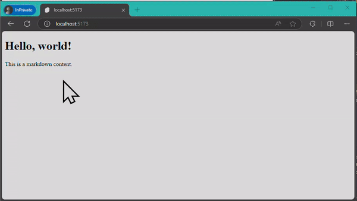

# スヴェルト開発日誌 1, POJO

私はマークダウンが好きで、その中でも特に好きな文法は [mermaidjs](https://mermaid.js.org/) です。

しかし、マーメイドは設計自体がブラウザで動作するようにデザインされているため、私のブログで重要視している「No Javascript」環境で動作させる方法を見つけられず、一時的に諦めていました。

どうすれば事前にパースして送信できるかを考えていると、[remark-mermaidjs](https://github.com/remcohaszing/remark-mermaidjs) プラグインを発見し、適用してみました。

> \[!note]
> このプラグインはノード環境で「playwright」を使用してブラウザ環境をシミュレーションし、マーメイドをレンダリングします。

## 問題



しかし、すぐに問題が発生しました。前述の通り、マーメイドはブラウザで動作するツールであるため、ハイドレーション段階でサーバーのレンダリング結果とブラウザのレンダリング結果が異なり、消えてしまう問題が発生しました。

## 解決

`+page.js`のコードはサーバーとクライアントでそれぞれ一度ずつ実行され、ハイドレーション過程が発生するため、マークダウンパースコードを `+page.server.js` に移動し、ハイドレーション過程を省略することに決めました。

**POJOエラー発生コード:**

```js
import Category from '$lib/post/Category.js';
import Post from '$lib/post/Post.js';

/** @type {import('./$types').PageServerLoad} */
export async function load({ url }) {
	return {
		post: Post.getPosts(url.pathname), // POJOエラー、クラスインスタンスを返す
		category: Category.getCategory(url.pathname) // POJOエラー、クラスインスタンスを返す
	};
}
```

**エラー:**

```sh
... Cannot stringify arbitrary non-POJOs ...
```

POJOを返さなかったため、レンダリングエラーが発生しました。そこで、各クラスのメソッドにシリアライズ関数を追加し、POJOオブジェクトを返すように変更しました。

**POJOを返すコード:**

```diff
import Category from '$lib/post/Category.js';
import Post from '$lib/post/Post.js';

/** @type {import('./$types').PageServerLoad} */
export async function load({ url }) {
  return {
--   post: Post.getPosts(url.pathname), // POJOエラー、クラスインスタンスを返す
++   post: Post.getPosts(url.pathname).toSerialize(), // POJOを返す
--   category: Category.getCategory(url.pathname)  // POJOエラー、クラスインスタンスを返す
++   category: Category.getCategory(url.pathname).toSerialize() // POJOを返す
  };
}
```

## 他の解決策

- JSON.stringify()
- serialize-javascript
- structuredClone()

などを使用して解決する方法もありますが、私の場合は他のツールでシリアライズが不可能だったため、直接関数を作成して進めました。

