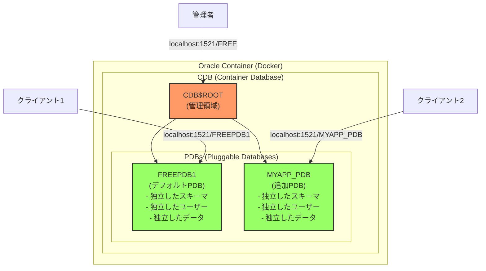

# Oracle Database概念ガイド

## Oracleとは？

Oracleは元々会社名ですが、Oracle Databaseがあまりにも有名になったため、一般的に「Oracle」と言えばOracle Databaseを指す代名詞になりました。

### Oracle Corporationの主要製品

- **Oracle Database**: リレーショナルデータベース管理システム（RDBMS）
- **Oracle Linux**: エンタープライズLinuxオペレーティングシステム
- **Java**: プログラミング言語とプラットフォーム
- **MySQL**: オープンソースデータベース
- **VirtualBox**: 仮想化ソフトウェア
- **WebLogic Server**: アプリケーションサーバー

## Container Registryとは？

Container RegistryはDockerイメージを保存・配布するリポジトリです：
- **Docker Hub**: Dockerの公式パブリックレジストリ（hub.docker.com）
- **Private Registry**: 企業が自社運営するプライベートレジストリ
- **Cloud Registry**: AWS ECR、Google GCR、Azure ACRなど

イメージをダウンロードする時：
```bash
docker pull nginx # Docker Hub（デフォルト）
docker pull gcr.io/project/image # Google Container Registry
docker pull container-registry.oracle.com/database/free # Oracle Container Registry
```

### Oracle Container Registry使用理由

Oracleは独自のContainer Registryを運営しており、それに伴う制約が存在します：
- ライセンス管理と使用規約の同意手続きが必要
- Enterprise Editionは商用ライセンス確認が必須
- セキュリティとサポートサービス提供のためのポリシー

これはアクセシビリティは低下しますが、企業顧客には公式サポートチャネルを提供する利点もあります。

> [!WARNING]
> Docker Hubで「oracle」を検索するとOracle Linuxイメージのみ表示されます。
> Oracle DatabaseイメージはDocker Hubにないので注意してください。
> Oracle DatabaseはOracle Container Registryでのみ公式提供されます。

## Oracle Databaseエディション比較

Oracle Databaseは複数のエディションで提供され、各エディションごとに制約事項が異なります。

### Express Edition（XE）
- **無料**使用可能
- CPU：最大2コアまで使用
- データベースサイズ：最大12GB
- RAM：最大2GBまで使用
- 開発と学習目的に適合

### Free Edition（23c）
- **無料**使用可能（2023年リリース）
- XEより多くの機能を提供
- CPU：最大2スレッド
- メモリ：最大2GB SGA + 2GB PGA
- ユーザーデータ：最大12GB
- 開発者向けの最新バージョンでXEを代替する目的

> [!TIP]
> 新しく始めるプロジェクトならXEよりFree Editionを使用するのが良いです。
> XEはレガシーシステムの互換性が必要な場合のみ使用し、可能であれば最新機能が含まれたFree Editionを選択してください。

### Standard Edition 2（SE2）
- **商用ライセンス必須**
- 中小規模企業向け
- CPU：最大2ソケットまでのみサポート
- RAC（Real Application Clusters）未サポート
- 高度なセキュリティ機能制限
- Enterprise Editionより安価なライセンス

> [!INFO]
> Oracleは Standard Editionの複雑なバージョン体系を運営しました：
> - **SE**：最大4ソケットサポート
> - **SE1**：最大2ソケットサポート（より安価なバージョン）
> - **SE2**：2015年にSEとSE1を統合
> 
> 現在はSE2のみ購入可能で、既存ライセンスはSE2に変換されます。

### Enterprise Edition（EE）
- **商用ライセンス必須**（最も高価なライセンス）
- 大規模企業向け
- すべての機能使用可能
- 制限なし
- RAC、Partitioning、Advanced Securityなどの高度な機能を含む

> [!INFO]
> Oracle Enterprise Editionは最低数千万円から始まる高価な商用ライセンスです。
> このような高い参入障壁のため、多くの企業がPostgreSQL、MySQLなどのオープンソース代替案を選択します。

## Oracleの核心概念

### Service Name vs SID

**SID（System Identifier）**
- データベースインスタンスの固有識別子
- Oracle 8i以前から使用された伝統的な方式
- 一つのインスタンスを直接指定
- 例：`free`、`XE`、`ORCL`

**Service Name**
- Oracle 8iから導入された論理的な名前
- 一つ以上のインスタンスを指すことができる（クラスター環境で有用）
- より柔軟で現代的な接続方式
- 例：`FREEPDB1`、`myapp.example.com`

**Service Nameは何を指すか？**
- Service Nameはデータベース自体ではなく**データベースに接続する経路**です
- スキーマでもありません（スキーマはユーザーアカウントとそのオブジェクトの集合）
- 簡単に言えば「データベースの電話番号」のような概念です
- 一つのデータベースが複数のService Nameを持つことができます

**隔離された空間はPDBです**
- **PDB（Pluggable Database）**：隔離された独立データベース空間
- **Service Name**：PDBに接続するための名札
- 例：`FREEPDB1`はService Nameであると同時にPDB名
- 各PDBは互いに隔離されて独立的に運営されます

> [!TIP]
> 最新のOracleではService Name使用を推奨します。
> 接続文字列でSIDは`:SID`形式、Service Nameは`/SERVICE_NAME`形式で使用します。

### CDB/PDBアーキテクチャ

PDB（Pluggable Database）はOracle 12cから導入されたマルチテナントアーキテクチャの核心概念です。

- **CDB（Container Database）**：全体を管理するルートコンテナ
- **PDB（Pluggable Database）**：実際のアプリケーションが使用する独立したデータベース

簡単に言えば、CDBはアパートの建物でPDBは各戸です。実際の作業はPDBで行われます。

> [!NOTE]
> Oracle FreeはデフォルトでFREEPDB1というPDBを一つ提供します。
> 必要時に追加PDBを作成でき、各PDBは完全に隔離されて独立的に運営されます。



> [!INFO]
> **他のデータベースとの比較**
> - Oracle PDB ≈ PostgreSQL Database
> - Oracle User ≈ PostgreSQL Schema
> - Oracle CDB ≈ PostgreSQL Cluster
> 
> PostgreSQLで`CREATE DATABASE myapp`するように
> Oracleでは`CREATE PLUGGABLE DATABASE myapp_pdb`を使用します。

### Oracleの独特なスキーマ概念

**Oracleの特異なスキーマ概念：**
Oracleにもスキーマがありますが、独特に動作します：
- **Oracleのスキーマ**：Userと1:1でマッピングされたオブジェクトコレクション
- Userを作成すると自動的に同じ名前のスキーマが生成される
- スキーマはそのUserが所有するすべてのオブジェクト（テーブル、ビュー、インデックスなど）の論理的コンテナ
- CREATE SCHEMAコマンドがあるが、実際にはUser作成時に自動的に作られる

**PostgreSQL/MySQLのスキーマ：**
```sql
-- PostgreSQL: Database内に複数のSchemaを作成可能
CREATE SCHEMA sales;
CREATE SCHEMA hr;
CREATE TABLE sales.orders (...);  -- salesスキーマにテーブル作成
CREATE TABLE hr.employees (...);   -- hrスキーマにテーブル作成
```

**Oracleのスキーマ：**
```sql
-- Oracle: Userを作るとSchemaが自動生成される
CREATE USER sales IDENTIFIED BY password;
CREATE USER hr IDENTIFIED BY password;
-- salesユーザーでログインするとsalesスキーマで作業
-- hrユーザーでログインするとhrスキーマで作業
```

**核心的な違い：**
- **他のDB**：Schemaはテーブルをグループ化する論理的ネームスペース
- **Oracle**：Schemaは存在するがUserと分離できない（User = Schema Owner）
- **他のDB**：一人のユーザーが複数のスキーマを作成/所有可能
- **Oracle**：一人のユーザー = 一つのスキーマ（1:1固定関係）

**注意：User作成 ≠ PDB作成**
```sql
-- PDB内でUser作成（同じPDB内の新しいスキーマ）
CREATE USER student IDENTIFIED BY pass123;  -- FREEPDB1内にstudentスキーマ作成
CREATE USER teacher IDENTIFIED BY pass456;  -- FREEPDB1内にteacherスキーマ作成

-- すべて同じFREEPDB1内にある！新しいPDBが生まれるのではない
-- PDBはCREATE PLUGGABLE DATABASEでのみ作成
```

**OracleでUser = Schemaである理由：**
```sql
-- studentでログインすると
CREATE TABLE scores (id NUMBER);  -- student.scoresテーブルが作成される

-- teacherでログインすると
CREATE TABLE classes (id NUMBER); -- teacher.classesテーブルが作成される

-- 他のユーザーのテーブルにアクセスするには
SELECT * FROM student.scores;     -- teacherがstudentのテーブルを照会
```

Oracleではユーザーを作ると自動的にそのユーザー名と同じスキーマが生成されます。
このスキーマはそのユーザーが作ったすべてのオブジェクト（テーブル、ビューなど）を含む空間です。

### ユーザー権限体系

**PDB内ユーザー権限体系：**
```sql
-- 一般ユーザー：自分のスキーマでのみ作業
CREATE USER student IDENTIFIED BY pass123;
GRANT CREATE SESSION, CREATE TABLE TO student;

-- DBA権限ユーザー：PDB全体管理
CREATE USER pdb_admin IDENTIFIED BY admin123;
GRANT DBA TO pdb_admin;  -- PDB内のすべての権限

-- 他のスキーマアクセス権限付与
GRANT SELECT ON student.scores TO teacher;  -- teacherがstudent.scoresを照会可能
```

**ユーザータイプ：**
- **一般ユーザー**：自分のスキーマでのみ作業（デフォルト）
- **DBA権限ユーザー**：PDB内のすべてのスキーマアクセス/管理（Database Administrator = データベース管理者）
- **SYS/SYSTEM**：CDBおよびすべてのPDB管理（最高権限）

**DBA権限の意味：**
- DBA = Database Administrator（データベース管理者）
- `GRANT DBA TO user`は「このユーザーを管理者にする」という意味
- PDB内でほぼすべての作業可能（テーブル作成/削除、ユーザー管理、バックアップなど）
- ただし、他のPDBにはアクセス不可（PDBごとに独立した管理者）

> [!NOTE]
> **Oracle用語の特徴**
> 
> Oracleは独自の用語体系を使用します：
> - マルチテナントアーキテクチャのためにCDB/PDB概念を導入（12cから）
> - 既存の単一インスタンス構造からクラウド時代に合わせて進化
> - 学習曲線は高いが、大規模エンタープライズ環境では有用な機能
> 
> ただし小さなプロジェクトではPostgreSQLなど、より単純な代替案を検討する価値があります。

## 接続情報

### Oracle Database 23c Free接続情報
- **SID**：free（小文字）
- **Service Name（CDB）**：FREE - ルートコンテナ接続用
- **Service Name（PDB）**：FREEPDB1 - 実際のデータベース接続用

一般的にアプリケーションはPDBであるFREEPDB1に接続します。
接続文字列の例：`username/password@hostname:1521/FREEPDB1`

### 客寄せ商品戦略

> [!INFO]
> ほとんどのContainer Registryはログイン後にイメージをダウンロードすることが原則です。
> しかしOracleはFree Editionを「客寄せ商品」として活用してログインなしでもダウンロードできるように許可します。
> Enterprise EditionやStandard Editionは依然としてOracleアカウントログインが必須です。