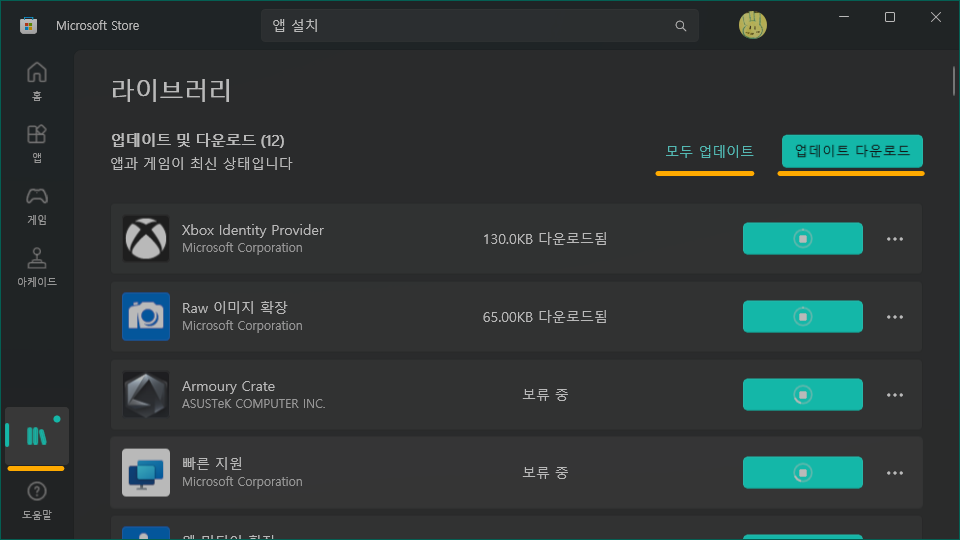

# WinGet 実行エラーの解決方法

コンピュータが遅くなったので、久しぶりに Windows を再インストールしました。  
そして `winget` コマンドでパッケージをインストールしようとしたところ、実行すらできない問題が発生しました。

`winget -v` コマンドは正常に動作しますが、`winget install` コマンドは実行できません。

## 解決方法

アプリインストーラーを更新する必要があります。

0. Microsoft Store を起動します。  
1. ライブラリで「更新のダウンロード」をクリックします。

