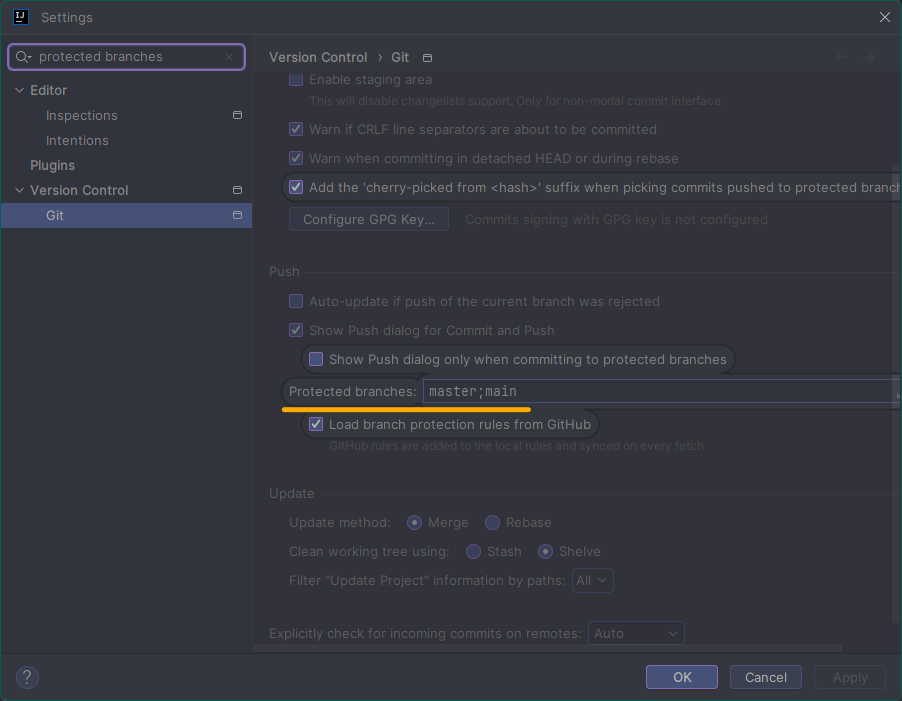

# INTELLIJでの強制プッシュの有効化

IntelliJでは、マスターやメインブランチに対して強制プッシュが基本的に保護されています。 \
これを解決する方法を見ていきましょう。

## シナリオ

GitHub Actionsを使用して自動デプロイを行うために、いくつかの文法エラーに遭遇しました。 \
そのため、コミットログに残った雑多なテストコードを整理するために、強制プッシュを有効にする必要がありました。

## 解決策

- 方法 0. <kbd>Ctrl</kbd> + <kbd>Shift</kbd> + <kbd>A</kbd> の組み合わせショートカットを入力して `Search Everywhere` ウィンドウを開きます。  
0. `Search Everywhere` ウィンドウで「Protected branches:」と入力し、一致する項目をクリックします。  
0. `settings` ウィンドウで `Protected branches:` フィールドを見つけ、内容を削除します。

## トラブルシューティング

GitHubとGitLabにはブランチ保護機能があるため、各リポジトリの設定を確認する必要があります。

