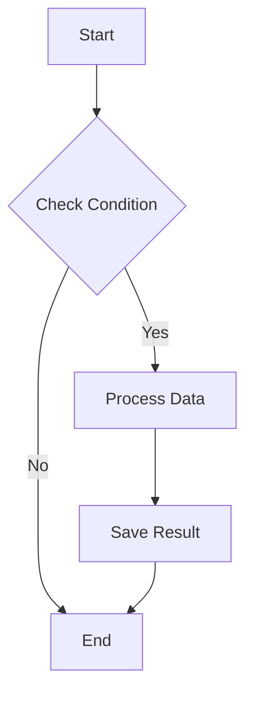
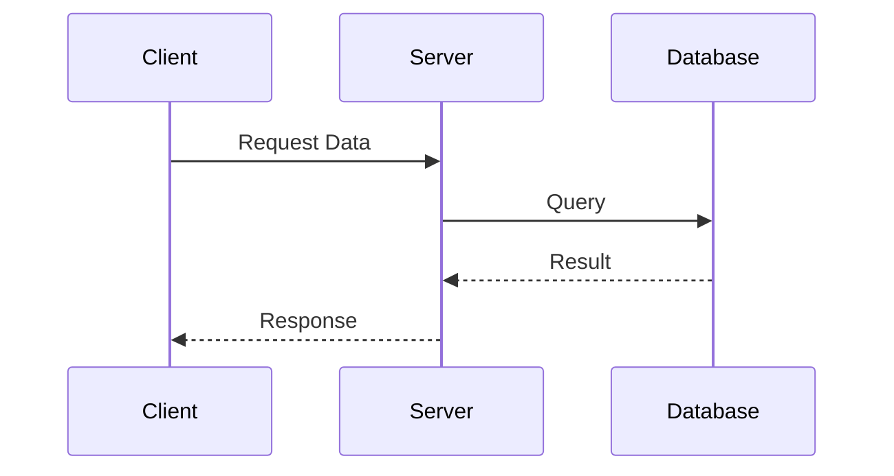
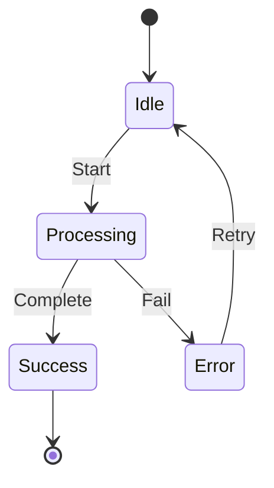
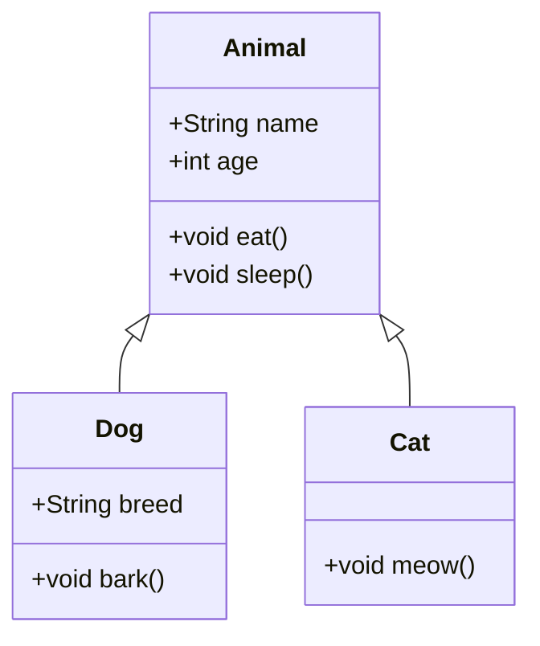

# Obsidian基本マークダウン機能

> [!NOTE]
> プラグインなしでObsidianでデフォルトで使用できるコードブロック機能です。

## プログラミング言語コードブロック

### Java
```java
public class HelloWorld {
    public static void main(String[] args) {
        System.out.println("Hello, Obsidian!");
        // This is a comment
    }
}
```

### Python
```python
def fibonacci(n):
    if n <= 1:
        return n
    return fibonacci(n-1) + fibonacci(n-2)

# Generate fibonacci sequence
result = [fibonacci(i) for i in range(10)]
print(result)
```

### JavaScript
```javascript
const fetchData = async (url) => {
    try {
        const response = await fetch(url);
        return await response.json();
    } catch (error) {
        console.error('Error:', error);
    }
};
```

### SQL
```sql
SELECT
    u.name,
    COUNT(o.id) as order_count,
    SUM(o.total) as total_spent
FROM users u
LEFT JOIN orders o ON u.id = o.user_id
WHERE o.created_at >= '2024-01-01'
GROUP BY u.id, u.name
ORDER BY total_spent DESC;
```

## Mermaidダイアグラム（基本サポート）

### フローチャート


### シーケンス図


### 状態図


### クラス図


## 数式（LaTeX）

### インライン数式
二次方程式 $ax^2 + bx + c = 0$ の解は $x = \frac{-b \pm \sqrt{b^2-4ac}}{2a}$ です。

### ブロック数式
正規分布の確率密度関数：
$$
f(x) = \frac{1}{\sigma\sqrt{2\pi}} e^{-\frac{1}{2}\left(\frac{x-\mu}{\sigma}\right)^2}
$$

フーリエ変換：
$$
\hat{f}(\xi) = \int_{-\infty}^{\infty} f(x) e^{-2\pi i x \xi} dx
$$

## テーブル（基本マークダウン）

| Method | Time Complexity | Space Complexity |
|--------|----------------|------------------|
| Bubble Sort | O(n²) | O(1) |
| Quick Sort | O(n log n) | O(log n) |
| Merge Sort | O(n log n) | O(n) |
| Heap Sort | O(n log n) | O(1) |

## チェックリスト

プロジェクト進行状況：
- [x] 要件分析
- [x] データベース設計
- [ ] API開発
  - [x] ユーザー認証
  - [ ] データCRUD操作
  - [ ] ファイルアップロード
- [ ] フロントエンド開発
- [ ] テスト
- [ ] デプロイ

## コールアウトボックス

> [!NOTE]
> 基本情報を伝える時に使用します。

> [!TIP]
> 便利なヒントや推奨事項を提供します。

> [!WARNING]
> 注意すべき事項を強調します。

> [!DANGER]
> 深刻な問題や危険を警告します。

> [!INFO]
> 追加的な背景情報を提供します。

> [!SUCCESS]
> 成功的な完了を示します。

> [!QUESTION]
> 質問や考慮事項を提示します。

> [!ABSTRACT]
> 要約や概要を表示します。

## 引用と強調

### 引用
> "The only way to do great work is to love what you do."
> — Steve Jobs

### ネストされた引用
> 最初のレベル
>> 二番目のレベル
>>> 三番目のレベル

### テキスト強調
- **太字** または __太字__
- *斜体* または _斜体_
- ***太字斜体*** または ___太字斜体___
- ~~取り消し線~~
- ==ハイライト== （Obsidian専用）

## リスト

### 順序付きリスト
1. First item
2. Second item
   1. Sub-item 2.1
   2. Sub-item 2.2
3. Third item

### 順序なしリスト
- Main point
  - Sub point
    - Sub-sub point
  - Another sub point
- Another main point

## 区切り線

3つ以上のハイフン、アスタリスク、アンダースコア：

---

***

___

## 画像とリンク

### リンク
[Obsidian公式サイト](https://obsidian)

### 画像


### 画像サイズ調整（Obsidian専用）


> [!TIP]
> これらの基本機能だけでも十分に豊富なドキュメントを作成できます！

## 次のステップ

マークダウン機能を習得したら：
- [同期設定](step-01) - 複数のデバイスでノートを使用